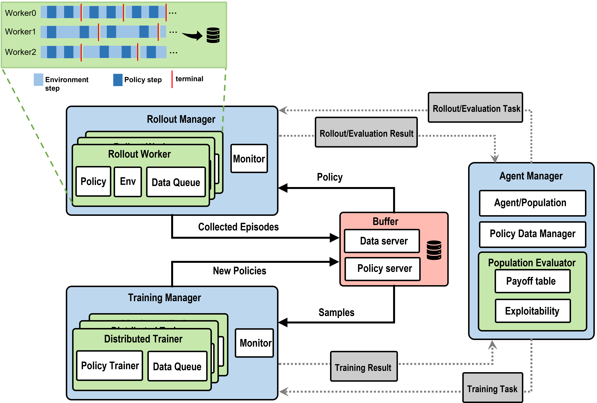

Introduction
============

**Light-MALib** is a Pythonic framework for Population-Based Multi-Agent Reinforcement Learning (PB-MARL). As the name suggests, L-MALib is a
simplified version of the `MALib <https://github.com/sjtu-marl/malib>`_ codebase which uses `Ray <https://www.ray.io/>`_ as a backend. L-MALib follows the design of an Actor-based RL systems which execute algorithms through message passing between a set of actors deployed on worker node.
Similar to MALib, L-MALib possess a high-level agent/evaluator/learner abstraction but drop the burdensome coordinator. This has made the codebase easy to read as well.

    Overview of the MALib architecture.

Features
^^^^^^^^^^^^^^^^^^^^^^^^^^^^^^^
The key features of L-MALib include:

* **Pytorch-based algorithm implementation**: All algorithms implemented in L-MALib are based on `PyTorch <https://pytorch.org/>`_.
* **Popular distributed computing RL framework support**: L-MALib support multiple distributed computing RL frameworks, including asynchronous  
* **GRF-specific toolkits**: L-MALib was initially designed to benchmark Google Research Football multi-agent scenarios. It provides some GRF-specific content that makes GRF-related research easier.

Citing MALib
^^^^^^^^^^^^
